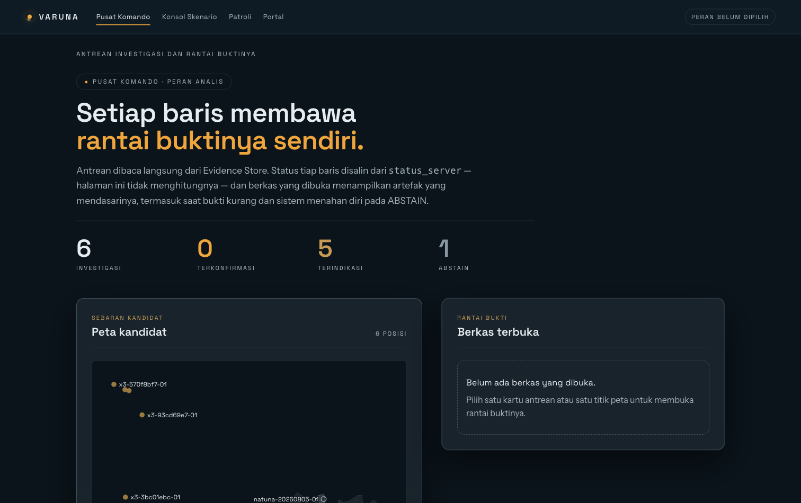
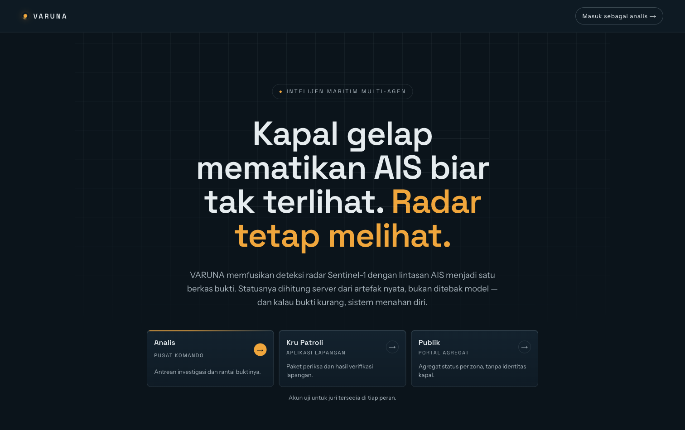
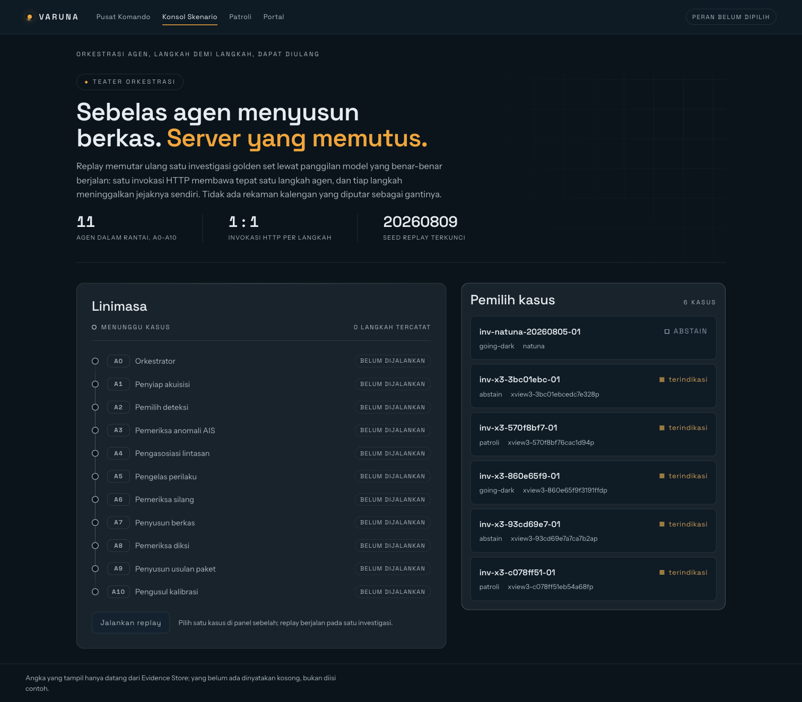
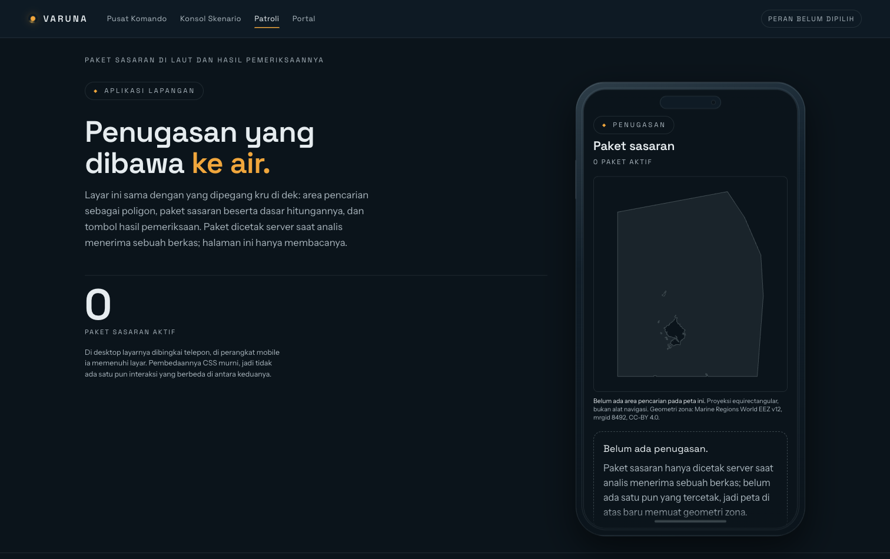
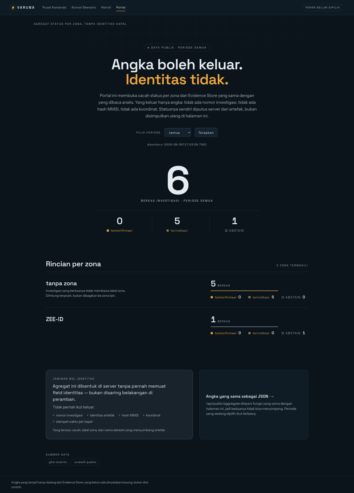
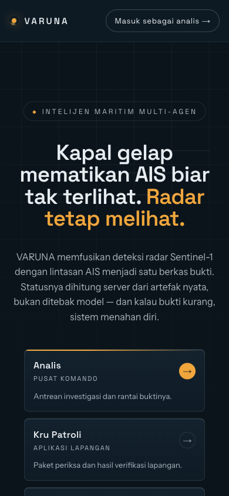
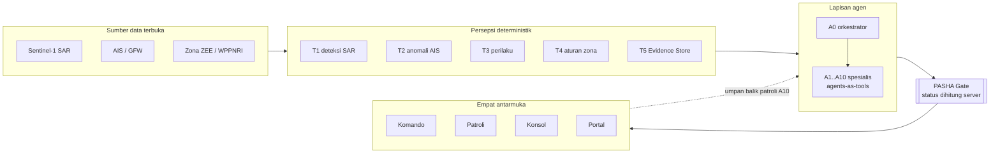
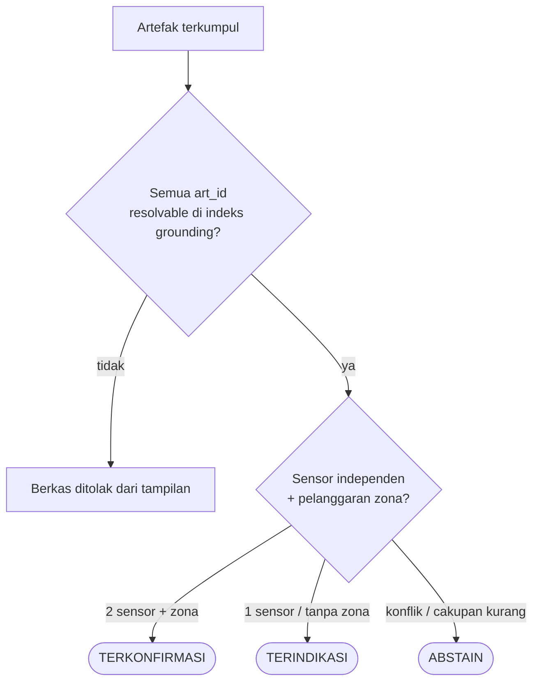
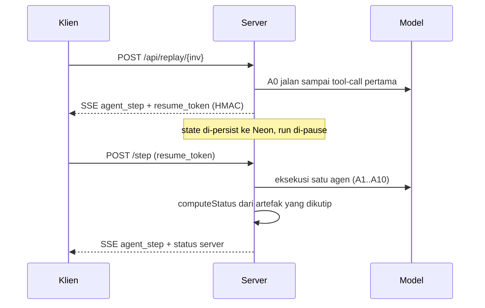

# VARUNA

[](LICENSE)
[](https://varuna-gamma.vercel.app)
[](paper.pdf)
[](https://github.com/Finerium/varuna/actions/workflows/ci.yml)
[](https://nextjs.org)
[](https://pnpm.io)
[](#status-dan-verifikasi)
[](protocol/eval-protocol.md)

> Kapal gelap mematikan AIS biar tak terlihat. Radar tetap melihat. VARUNA mengubahnya jadi berkas bukti yang bisa diperiksa.

VARUNA adalah sistem intelijen maritim *multi-agent* untuk penindakan *illegal fishing* di perairan Indonesia. Ia memfusikan deteksi radar Sentinel-1 dengan lintasan AIS menjadi satu berkas bukti multisensor, lalu menghitung status berkas itu di server dari artefak yang ada — bukan menyimpulkannya dengan model. Ketika bukti bertentangan atau cakupan sensor tak memadai, sistem memilih ABSTAIN dan mengatakannya apa adanya.

**Produksi:** https://varuna-gamma.vercel.app · **Paper:** [12 halaman, PDF](paper.pdf) · **Bobot & data:** [Hugging Face](#dokumen)
**Loncat:** [Status & verifikasi](#status-dan-verifikasi) · [Lapisan mana yang menanggung beban](#lapisan-mana-yang-menanggung-beban) · [Dibanding sistem yang sudah ada](#dibanding-sistem-yang-sudah-ada) · [Residual yang jujur](#residual-yang-jujur)



---

## Ringkasan produk

Satu aplikasi web dari sudut pandang pengguna, satu monorepo TypeScript dari sudut pandang pembangun. Empat antarmuka melayani empat peran; di belakangnya, persepsi deterministik memisahkan diri dari penalaran agen, dengan **PASHA Gate** sebagai gerbang sisi server yang tidak pernah dilewati frontend.

Kebaruannya sempit dan dipertahankan: penyedia lain sudah *grounding*, *abstain*, dan menyerahkan keputusan ke manusia. Yang belum dilakukan mereka — dan yang VARUNA garap — adalah **berkas yang mengikuti kerangka pembuktian hukum acara Indonesia** dan **siklus patroli tertutup** yang mengembalikan hasil pemeriksaan di laut menjadi kalibrasi sistem. Perbandingan berdampingan yang jujur ada di [Dibanding sistem yang sudah ada](#dibanding-sistem-yang-sudah-ada).

## Masalah yang ditangani

Indonesia mengawasi 6,4 juta km² laut dengan kapasitas patroli yang menyusut. Analisis dua petabita citra satelit menemukan 72–76% kapal ikan industri dunia tidak terlacak publik. Modusnya berulang: kapal mematikan transponder AIS menjelang zona sasaran (*going dark*), memalsukan posisi, menukar identitas MMSI, lalu memindahkan muatan di tengah laut. Citra Sentinel-1 gratis dan pesan AIS mengalir terus, tetapi belum ada sistem yang mengubah keduanya menjadi keputusan penindakan yang dapat dipertanggungjawabkan di hadapan penyidik.

## Demo dan sumber

| | |
|---|---|
| **URL produksi** | https://varuna-gamma.vercel.app |
| **Masuk cepat — Analis** | https://varuna-gamma.vercel.app/enter/analis (set peran, alih ke Pusat Komando) |
| **Masuk cepat — Patroli** | https://varuna-gamma.vercel.app/enter/patroli |
| **Portal Publik** | https://varuna-gamma.vercel.app/portal |
| **Repositori** | https://github.com/Finerium/varuna (MIT, publik) |
| **Bobot detektor** | [`Finerium/varuna-detector`](https://huggingface.co/Finerium/varuna-detector) (Hugging Face) |
| **Dataset** | [`Finerium/varuna-golden-set`](https://huggingface.co/datasets/Finerium/varuna-golden-set) |

## Tur visual

Semua tangkapan layar berikut adalah produk yang benar-benar berjalan di URL produksi, bukan maket.


*Halaman masuk menjelaskan sistem dalam dua detik dan menyalurkan tiga peran. Chip di landing adalah potongan band VH dari scene Sentinel-1 yang benar-benar diunduh.*


*Pusat Komando: peta kandidat berlatar garis pantai Indonesia, antrean investigasi sebagai kartu dengan badge status, dan rantai bukti yang terbuka melekat di kanan. Status tiap baris disalin dari `status_server` — halaman ini tidak menghitungnya.*


*Konsol Skenario memutar ulang investigasi lewat linimasa sebelas agen (A0–A10) dengan panggilan model langsung. Angka header terikat kontrak: 11 agen, satu invokasi HTTP per langkah, seed replay 20260809.*


*Patroli dirender dalam bingkai telepon di desktop, penuh layar di ponsel: area pencarian sebagai poligon, paket sasaran, dan tombol hasil pemeriksaan yang menutup siklus.*


*Portal Publik membuka agregat status per zona tanpa satu pun field identitas kapal. Angka dijumlahkan dari matriks yang sama yang dilayani `/api/public/aggregate`.*

<p align="center"></p>
<p align="center"><em>Responsif hingga 390px; register gerak reduced-motion-first.</em></p>

## Alur juri yang disarankan

Total ± 8 menit. Tiap langkah menyebut satu hal yang **harus terlihat** supaya bisa dibedakan dari demo bermulut manis.

1. Buka **[halaman masuk](https://varuna-gamma.vercel.app)** — yang harus terlihat: chip SAR nyata (bukan ikon) dan strip bukti (F1 0,854 · red-team 24/24 · klaim tanpa artefak: 0).
2. Klik **[Masuk cepat — Analis](https://varuna-gamma.vercel.app/enter/analis)** (satu klik memasang cookie peran dan mengalihkan ke Pusat Komando). Buka `inv-natuna-20260805-01` — yang harus terlihat: status **ABSTAIN** dengan enam alasan *rule* eksplisit dan usia bukti 100,5 jam; sistem menahan diri karena cakupan kurang, bukan karena ragu.
3. Buka **[Konsol Skenario](https://varuna-gamma.vercel.app/konsol)**, jalankan replay — yang harus terlihat: tiap langkah memunculkan `agent_step` SSE baru dalam ~3–5 detik dari panggilan model sungguhan (replay penuh 9 langkah ~30 detik); tanpa `OPENAI_API_KEY` ia gagal terbuka, tidak memutar rekaman kalengan.
4. Buka **[Portal Publik](https://varuna-gamma.vercel.app/portal)** — yang harus terlihat: nol identitas kapal; buka `/api/public/aggregate` dan cocokkan angkanya dengan yang di layar.
5. Baca **[paper](paper.pdf)** untuk protokol beku, angka evaluasi, dan tabel deviasi yang mengakui setiap janji yang meleset atau tertunda.

## Arsitektur



Prinsip yang mengikat implementasi:

- **Status hanya server-side.** `computeStatus` adalah fungsi murni di `packages/core`; endpoint produk, pembangun golden set, dan harness evaluasi memanggil fungsi yang sama, sehingga angka evaluasi mendeskripsikan persis gerbang yang dikirim ke produksi.
- **Grounding wajib.** Setiap `art_id` pada keluaran agen harus resolvable di indeks bukti; yang tidak resolvable dibuang dan tercatat di *trace* — ditegakkan juga di jalur baca sebelum berkas sampai ke analis.
- **ABSTAIN adalah keluaran sah.** Sistem menunggu lintasan berikutnya daripada menebak.
- **Identitas dilindungi.** MMSI hanya hidup sebagai HMAC-SHA256 pseudonim 16-hex; golden set demo memakai garam *dev* yang masih tertanam di kode (residual jujur, diakui paper §4.6 dan `manifests/e8-hasil.json`), belum dibaca dari *environment*.

## Cara kerja: PASHA Gate

Status tidak pernah datang dari model. Ia dihitung server dari artefak yang tersedia:



Gerbang itu lima lapis, tiap lapis satu penjaga yang bisa ditunjuk ke file:

| Lapis | Mekanisme | File | Menahan |
|---|---|---|---|
| Pemisahan persepsi/penalaran | agen mengusulkan, tak pernah memutus; status milik server | `packages/agents` executor + `pasha.ts` | vonis fabrikasi |
| Indeks grounding | tiap `art_id` harus resolvable; sisanya dibuang + dicatat di *trace* | `packages/core/grounding.ts` | klaim tanpa artefak |
| Perhitungan status server | `computeStatus` murni memutuskan status dari artefak | `packages/core/pasha.ts` | vonis fabrikasi |
| Peluruhan usia bukti | bukti kedaluwarsa menurunkan status, tidak dibiarkan | `pasha.ts` (`usia_max_h`) | keputusan atas bukti basi |
| Penyaring diksi + pemeriksa A8 | kata putusan hukum ditolak sebelum tayang | `packages/core/diksi.ts` + A8 | diksi putusan bocor |

Bagi kapal yang mematikan AIS, deteksi SAR yang berimpit jeda transmisi jejak historisnya dihitung dua sensor independen, dihubungkan uji kelayakan kinematik dari titik hilang sinyal ke posisi deteksi — dan barulah `computeStatus` menaikkannya ke TERINDIKASI atau TERKONFIRMASI.

## Lapisan mana yang menanggung beban

Klaim "lima lapis" tidak berhenti sebagai desain. Kami mematikan tiap lapis satu per satu (*leave-one-out*) di atas 73 investigasi golden dan mengukur berapa banyak yang bocor. Tiap kolom adalah satu jenis kegagalan; tiap angka adalah "berapa dari 73 yang lolos ketika lapis itu dicabut". PASHA penuh = nol di semua kolom.

| Lapis dimatikan | Klaim tanpa artefak lolos | Vonis fabrikasi lolos | Diksi putusan bocor |
|---|---|---|---|
| — (PASHA penuh) | 0/73 | 0/73 | 0/73 |
| Indeks grounding | **73/73** | 0/73 | 0/73 |
| Status server¹ | 0/73 | **73/73** | 0/73 |
| Penyaring diksi A8 | 0/73 | 0/73 | **73/73** |
| Peluruhan usia bukti | 0/73 | 0/73 | 0/73² |

Tiap lapis adalah satu-satunya penahan jenis kegagalannya: cabut grounding, semua 73 klaim beralamat palsu lolos; cabut status server, semua 73 vonis melampaui-bukti lolos. Lalu, apakah menuliskannya di *prompt* saja cukup? Tidak:

| Konfigurasi fusi | Klaim tanpa artefak lolos |
|---|---|
| Tanpa gerbang | 73/73 |
| Guardrail hanya di *prompt* | 73/73 |
| Gerbang server penuh | 0/73 |

Guardrail *prompt-only* menambah **nol** proteksi yang dapat ditegakkan — persis alasan PASHA hidup di server, bukan di instruksi model. ¹Pada kode, "persepsi terpisah dari penalaran" dan "status milik server" adalah satu penjaga; LOO tak memisahkannya pada metrik ini. ²70 investigasi nyata membawa `evidence_age ≈ 0`; lapis ini divalidasi pada skenario peluruhan E5.5, bukan set pelaporan ini. Semua probe **sintetis** *by-construction* (seed 20260809) dan adjudikasinya **proksi**, bukan manusia ganda-buta — perinciannya di [`manifests/e7-loo.json`](manifests/e7-loo.json) dan [`manifests/e7-lengan.json`](manifests/e7-lengan.json).

## Replay agen langsung

Agen berjalan pada Responses API dengan pola *agents-as-tools*, di-pause dan di-persist tiap tool-call agar satu invokasi HTTP tidak melewati batas 300 detik Vercel:



## Status dan verifikasi

Seluruh definisi metrik, ukuran sampel, dan *seed* dibekukan sebelum eksperimen pertama pada tag `freeze-eval-v1` (commit `0bc9af9`). Angka yang meleset dari target tetap dilaporkan; yang belum terukur ditulis sebagai belum terukur.

| Klaim | Target | Terukur | Sumber |
|---|---|---|---|
| F1 lokalisasi lepas pantai | ≥ 0,75 | **0,854** (P 0,857 / R 0,851) | [`e1-hasil.json`](manifests/e1-hasil.json) |
| Agregat xView3 | ~0,603 (juara) | 0,606 — reproduksi setia | [`e1-hasil.json`](manifests/e1-hasil.json) |
| Paritas praproses SAR (VH/VV overlap) | tinggi | 0,958 / 0,983 atas 424,5 juta piksel | [`e1-paritas-hasil.json`](manifests/e1-paritas-hasil.json) |
| Deteksi spoofing AIS (P / R) | dilaporkan jujur | 0,733 / 0,500 (batas kemampuan) | [`e2-hasil.json`](manifests/e2-hasil.json) |
| Klasifikasi perilaku (konkordansi / κ) | tinggi | 0,875 / 0,678 | [`e3-hasil.json`](manifests/e3-hasil.json) |
| Red-team adversarial tertangkap | 100% | **24/24**, 0 *false-ABSTAIN* | [`e7-redteam.json`](manifests/e7-redteam.json) |
| PASHA: klaim tanpa artefak lolos | 0 | **0 dari 73** | [`e7-loo.json`](manifests/e7-loo.json) |
| Audit kesesuaian kerangka hukum (κ) | substansial | 0,694 (batas atas, penilai internal) | [`e8-hasil.json`](manifests/e8-hasil.json) |
| Stabilitas keputusan k=5 replay LIVE | 6/6 status | **6/6** sepakat; *hash* server 0/6 (lihat [residual](#residual-yang-jujur)) | [`e5-stabilitas.json`](manifests/e5-stabilitas.json) |
| Biaya agen per investigasi | efisien | ~20–22 rb token masuk / ~800 keluar / 17 panggilan | [`e10-token.json`](manifests/e10-token.json) |
| Asosiasi lintas sensor (E4, Denmark) | — | **belum terukur** (kendala GPU) | tabel deviasi paper |
| Pergeseran domain Natuna (E1b) | — | **belum terukur** (kendala GPU) | tabel deviasi paper |
| Baseline manusia (E9) | — | **belum terukur** (menunggu penilai) | tabel deviasi paper |
| Uji | hijau | core 340 · agents 22 · web 44 | `pnpm -r test` |

## Residual yang jujur

Yang terkuat dari sistem ini bukan satu pun angka di atas, melainkan bahwa kami mendaftar batasnya sekeras kami mendaftar keberhasilannya — dan hanya VARUNA yang punya pra-registrasi untuk dilanggar.

1. **Bobot detektor dilatih pada split *validation* xView3** (bocor geografis antar-lipatan), jadi 0,854 mengukur **kesetiaan reproduksi, belum generalisasi**. Angkanya jujur untuk apa yang diklaimnya, tidak lebih.
2. **Laju ABSTAIN terukur 1,4%** — di bawah rentang pra-registrasi **10–25%**. Ini rentang yang **dilanggar, bukan disesuaikan**: set fase ini nyaris seluruhnya kasus satu-modalitas *going-dark* yang memang seharusnya TERINDIKASI, bukan ABSTAIN.
3. **Determinisme server lintas replay LIVE belum tercapai:** *hash* `status_server` identik **0/6**, artefak dirujuk identik **3/6**, karena tiap replay membawa stempel waktu berbeda. Reprodusibilitas bit hanya berlaku pada masukan identik — pelanggaran §0.7 yang manifesnya sendiri **wajibkan dilaporkan**, bukan ditutup.
4. **Tertunda oleh GPU / penilai:** asosiasi Denmark (E4), pergeseran domain Natuna (E1b), baseline manusia (E9). Ekspor berkas utuh untuk penyerahan formal ke penyidik masih manual.
5. **Garam HMAC MMSI masih tertanam di kode** (garam *dev* golden set, belum dibaca dari *environment*), jadi pseudonim golden demo sengaja dapat dibalik — datanya memang AIS terbuka DMA. Migrasi garam ke *environment* ada di daftar perbaikan; diakui paper §4.6 dan audit `experiments/e8/adjudikasi.md`.

Semua tercatat terbuka di tabel deviasi paper, bukan dilunakkan. Peta pemulihannya ada di [Roadmap](#roadmap).

## Dibanding sistem yang sudah ada

Skylight/Shippy (Ai2) adalah pembanding terdekat yang publik. Tabel ini **deskriptif, bukan klaim keunggulan**: sisi VARUNA hanya memuat fitur yang diverifikasi *live* atau ada sebagai kode di repo; sisi Shippy bersumber dokumentasi publik bertanggal (9 Agu 2026).

| Dimensi | Shippy/Skylight (dok publik) | VARUNA (live/repo) |
|---|---|---|
| Perilaku abstain | "stops rather than guessing" | `abstain` keluaran kelas satu; `/api/public/aggregate` live menampilkan `counts.abstain` |
| Posisi thd penentuan hukum | Menolak membuat penentuan hukum | Tidak memutus perkara; menyusun bundel bukti mengikuti struktur **hukum acara RI** — keputusan tetap di penyidik |
| Alur patroli | Rekomendasi taktis di luar scope; *overstep* diperlakukan sebagai bug | Paket target + hasil verifikasi + kalibrasi **menutup siklus** (`api/patrol/*`, `api/calibration`) |
| Verifikasi jawaban | Sitasi per sumber + deep link + timestamp | Provenance per artefak `/api/artifacts/<art_id>`; status dihitung **server, bukan model** |

Dimensi yang hanya terbukti satu sisi (bahasa antarmuka, kerangka hukum RI, siklus patroli tertutup, replay agen) sengaja **dikeluarkan** sebagai asimetri dokumentasi — mengklaimnya sebagai kekalahan Shippy tidak *fair*. Versi penuh, tiap klaim bertanggal + URL, ada di [`experiments/e11/shippy-review.md`](experiments/e11/shippy-review.md).

## Pilihan teknologi

Tiap keputusan ditulis sebagai *pilihan — alternatif yang ditolak — alasan*. Pemetaan lengkap ke ADR ada di [`contracts/architecture.md`](contracts/architecture.md).

- **Next.js App Router, satu runtime** — bukan backend Python terpisah — supaya `computeStatus` yang **sama** dipakai produk, pembangun golden set, dan harness eval; angka evaluasi jadi mendeskripsikan gerbang produksi, bukan sepupunya.
- **Skema Zod tunggal** (`packages/core`) — bukan dua skema (validasi vs *structured output*) — satu sumber kebenaran, tidak ada *drift* antara yang divalidasi server dan yang diminta ke model.
- **Neon append-only** — bukan store yang bisa ditimpa — replay/patroli/kalibrasi menjadi jejak yang dapat diaudit ulang.
- **Kode inferensi juara-1 xView3 (BloodAxe, MIT) apa adanya** — bukan latih ulang — reproduksi setia yang dapat diaudit lebih dipertahankan daripada angka lebih tinggi yang tak bisa ditelusuri asalnya.
- **Gerak & visual:** GSAP + ScrollTrigger, Lenis, Motion (*reduced-motion-first*); Space Grotesk / Instrument Sans; amber sebagai satu-satunya warna sinyal.

## Batas keamanan dan privasi

| Pertanyaan | Jawaban | Bukti |
|---|---|---|
| Bocorkah identitas kapal? | MMSI hanya HMAC-SHA256 16-hex; garam *dev* masih tertanam di kode (residual E8, diakui paper §4.6) — pseudonim golden demo karenanya dapat dibalik, datanya memang AIS terbuka DMA; Portal nol-identitas di level skema | `packages/core` (`mmsi_hash`), `experiments/e8/adjudikasi.md` |
| Bisakah peran salah menulis? | Peran = pemilih register, bukan otentikasi; matriks *role-write* 403 sebelum 501 | route handler tulis |
| Amankah token replay? | `resume_token` ber-HMAC, verifikasi *timing-safe* + allowlist kunci + containment path | `executor.ts`, `gudang.ts` |
| Masuk data mentah ke git? | Tidak; GeoTIFF/AIS mentah tak pernah di-commit, hanya artefak turunan web-optimized | `.gitignore` + `packages/core/golden` |

**Ketika ada yang gagal:** tanpa `OPENAI_API_KEY`, replay gagal terbuka — tidak memutar rekaman. Artefak tak resolvable dibuang dan tercatat di *trace*. Cakupan kurang → ABSTAIN, bukan tebakan.

## Struktur repositori

```
apps/web/            Next.js — lima permukaan (komando|patroli|konsol|portal + entry) + API
packages/core/       TS murni: skema Zod, pasha.ts (computeStatus), grounding.ts, diksi.ts, store.ts
packages/core/golden/ subset demo 6 investigasi yang dilayani produk (artefak + chip SAR)
packages/agents/     @openai/agents A0–A10 + executor replay pause-persist
experiments/         E1-E3, E5-E8, E10-E11 (Python; E7 sebagian TS membungkus core)
experiments/e5/goldenset/  golden set evaluasi LENGKAP: 73 investigasi (sumber semua angka "/73")
scripts/             utilitas akuisisi & pembangun data (Python; bukan jalur runtime produk)
manifests/           manifes hasil (append-only) — satu-satunya sumber angka yang boleh dikutip
protocol/            eval-protocol.md (BEKU, freeze-eval-v1) + janji-audit.md
contracts/           kontrak field & arsitektur (BEKU)
```

## Menjalankan secara lokal

Prasyarat: Node.js 22–24 dan pnpm 10.33.2. Aktifkan lewat `corepack enable` (Node 22–24) atau, pada Node ≥ 25 yang tak lagi membundel corepack, `npm i -g pnpm@10.33.2`.

```bash
pnpm install                        # dependensi seluruh workspace
pnpm -r test                        # 340 core + 22 agents + 44 web, semua hijau
pnpm -r typecheck && pnpm -r lint    # tsc --noEmit semua workspace + eslint apps/web
pnpm --filter web dev               # http://localhost:3000
```

Permukaan baca dan golden set berjalan tanpa secret. Replay agen langsung membutuhkan `OPENAI_API_KEY` yang dipropagasi via `vercel env` — tidak ada secret di dalam repo.

**Reproduksi angka PASHA (tanpa GPU, tanpa secret):**

```bash
python3 experiments/e7/loo.py   # tulis ulang manifests/e7-loo.json + e7-lengan.json
git diff manifests/             # hanya run_id & commit yang berubah; angka /73 identik
```

Butuh Python 3.11+ (stdlib) dan `npx tsx`; driver membungkus fungsi core asli di `packages/core`, tidak memport logikanya — jadi ablasi PASHA di paper bereproduksi bit-identik dari clone segar.

## Protokol evaluasi (beku)

Protokol dibekukan sebelum implementasi pada tag `freeze-eval-v1` (commit `0bc9af9`) di `protocol/eval-protocol.md`. Semua angka hasil datang dari jalur evaluasi tersebut dan dicatat di `manifests/`. Perubahan protokol hanya lewat bagian Amandemen yang tercatat.

Satu **syarat mutlak** ditegakkan di CI: gerbang grounding di `apps/web/lib/cek.ts` berjalan sebagai bagian `pnpm test`, memuat golden set ter-*commit*, dan **menggagalkan rilis** bila satu berkas pun ditolak grounding — dan bila Evidence Store tak ter-*resolve*, itu pun merah, bukan lolos diam. Semantik penolakannya diuji unit di `packages/core/test/grounding.test.ts`.

## Roadmap

Bukan aspirasi; tiap item menyebut mekanismenya.

1. **Jalur GPU** (pin *environment* Kaggle lama atau GPU cloud) memulihkan asosiasi Denmark (E4) dan pergeseran domain Natuna (E1b) yang kini tertunda.
2. **Ekspor berkas utuh** (paket PDF + artefak ber-hash) untuk penyerahan formal ke penyidik — kini masih manual.
3. **Baseline manusia E9** dengan penilai eksternal, mengangkat κ 0,694 dari batas-atas penilai internal ke angka yang benar-benar antar-manusia.
4. **Feed AIS operasional** menggantikan snapshot golden, supaya siklus patroli tertutup berjalan atas data hidup.
5. **On-prem** untuk kepatuhan UU PDP: identitas kapal tak keluar yurisdiksi penindakan.

## Dokumen

- **[Paper semifinal](paper.pdf)** (12 halaman, format dua kolom gaya NeurIPS): protokol beku, angka evaluasi, tabel deviasi, dan diskusi kegagalan yang mengakui setiap keterbatasan.
- **Bobot & dataset:** [`Finerium/varuna-detector`](https://huggingface.co/Finerium/varuna-detector) (MIT, atribusi BloodAxe) + [`Finerium/varuna-golden-set`](https://huggingface.co/datasets/Finerium/varuna-golden-set) (Copernicus).

| Berkas | Isi | Status |
|---|---|---|
| [`protocol/eval-protocol.md`](protocol/eval-protocol.md) | protokol evaluasi + definisi metrik | **BEKU** |
| [`protocol/janji-audit.md`](protocol/janji-audit.md) | peta janji proposal → bukti | **BEKU** |
| [`contracts/architecture.md`](contracts/architecture.md) | keputusan arsitektur (ADR) | **BEKU** |
| [`experiments/e11/shippy-review.md`](experiments/e11/shippy-review.md) | head-to-head Shippy/Skylight bertanggal | referensi |
| [`manifests/`](manifests) | 23 berkas manifes (append-only) | sumber angka |

## Lisensi dan atribusi

Kode di bawah **MIT** (lihat [LICENSE](LICENSE)). Berdiri di atas:

- **xView3 first place solution** — Eugene Khvedchenya (BloodAxe), [DIUx-xView/xView3_first_place](https://github.com/DIUx-xView/xView3_first_place), MIT.
- **xView3-SAR labels** — CC BY-NC-SA; tidak didistribusikan di repo, unduh dari [iuu.xview.us](https://iuu.xview.us/).
- **Copernicus Sentinel-1** via Copernicus Data Space Ecosystem; mengandung data Copernicus Sentinel termodifikasi.
- **Danish Maritime Authority** (data AIS [aisdk](https://dma.dk/)), **Global Fishing Watch** (CC BY-NC), **Marine Regions** (ZEE v12).

Data mentah tidak pernah masuk repo; identitas kapal hanya hadir sebagai pseudonim.

## Tim

**Tim Rajendra**, Politeknik Negeri Bandung.

- Ghaisan Khoirul Badruzaman
- Hafiz Fauzan Syafrudin
- Elang Permadi Lau

Dibangun untuk semifinal Datathon 2026, RISTEK Fakultas Ilmu Komputer Universitas Indonesia.
